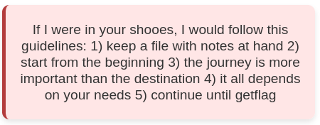

# Language Generator Writeup

## Italiano

- [Panoramica della Challenge](#panoramica-della-challenge)
- [Vicolo Cieco](#vicolo-cieco)
- [Soluzione Passo-Passo](#soluzione-passo-passo)
- [Derivazioni](#derivazioni)
- [Conclusione](#conclusione)

## English

- [Challenge Overview](#challenge-overview)
- [Honeypot](#honeypot)
- [Step-by-Step Solution](#step-by-step-solution)
- [Derivations](#derivations)
- [Conclusion](#conclusion)

## Panoramica della Challenge

La challenge Language Generator si presenta come un sito web interattivo in cui l'utente è invitato a generare un linguaggio personalizzato. L'utente dovrà creare grammatiche utilizzando le produzioni proposte. Per chi non ha familiarità con i concetti di linguaggi di programmazione, sarà necessario fare una breve ricerca online per comprendere il significato di produzione, grammatica, riconoscitore e generatore.

Il sito web offre diverse informazioni, ma non tutte sono utili per recuperare la flag. In particolare, i div di colore azzurro e arancione sembrano essere distrazioni, mentre quello rosso fornisce alcuni indizi cruciali. Anche se presentati in modo criptico, questi indizi sono fondamentali per risolvere la challenge, in cui ogni informazione deve essere usata con attenzione per dedurre il passo successivo e poter proseguire.


La seconda sezione del sito elenca le produzioni disponibili, che possono essere selezionate per costruire una grammatica e sottometterla al generatore, previa assegnazione di un nome.

Infine, l’ultima sezione contiene tre pulsanti che permettono di accedere ad informazioni sulla sessione.


## Vicolo Cieco

I pulsanti per scaricare file come hint.txt, log.txt e flag.txt sembrano vulnerabili alla modifica dei parametri, inducendo a tentare un client-side validation bypass con strumenti come Burp Suite. Un attaccante potrebbe provare a cambiare l'ID nella richiesta GET, sperando in una falla lato server.

```download.php?id=valore_non_previsto```

Tuttavia, il server convalida correttamente l’ID, rendendo inutile questa tecnica. Questo comportamento funge, in qualche modo, da honeypot; in sintesi un vicolo cieco.

## Soluzione Passo-Passo

L'ultimo suggerimento si distingue subito come il più interessante, poiché menziona esplicitamente la flag. Seguendo questa intuizione, il primo tentativo naturale consiste nel costruire una grammatica che generi la stringa "getflag" utilizzando le produzioni disponibili. Tuttavia, anche selezionando le regole corrette, ADGPQY, il sistema non restituisce alcun risultato utile.
Generare "getflag" non è stato sufficiente...

Tra tutte le grammatiche possibili, la prima da provare è la più semplice: quella che utilizza la produzione R: hint. Questa grammatica è particolarmente interessante perché, nel lato destro della produzione, troviamo esclusivamente la stringa "hint", che è una sequenza di simboli terminali. I simboli terminali sono caratteri concreti che non necessitano di ulteriori espansioni. Inoltre, la stringa "hint" appare particolarmente significativa e invogliante.
Il contenuto del file hint.txt restituisce il messaggio:

```Please be kind and ask politely```

A questo punto, il passo successivo è cercare una grammatica che produca un messaggio più gentile, magari iniziando con "please". La produzione F: plS sembra promettente, ma si rivela una falsa pista. Le produzioni corrette da utilizzare sono AHLSW, che, combinate, generano la stringa "pleasehint".
Con questa grammatica, il contenuto del file hint.txt cambia ancora e ora appare un messaggio più significativo:

```If only you could convince me to show you the log...```

A questo punto, cerchiamo le produzioni che contengono le lettere di "log". La produzione K: loG | Jf sembra essere la più promettente. Effettivamente, è possibile comporre la stringa "showlog" utilizzando le produzioni BGHKW.
Un'osservazione interessante è che sarebbe istintivo includere anche la produzione P, sfruttando l'opzione ε (epsilon), che rappresenta una produzione vuota. Tuttavia, non possiamo includerla, poiché il sistema impone un limite di massimo 5 produzioni da utilizzare. Fortunatamente, anche senza la produzione P, tutto funziona correttamente. Questo accade perché l'espansione dei simboli non terminali non inclusi nella grammatica restituisce ε. Il risultato ottenuto è particolare. Possiamo accedere al log che risulta però cancellato.
Ed inoltre compare un ulteriore indizio.

```I understood what you had in mind and decided to add L and V to your productions```

Effettivamente aggiungendo quelle produzioni vengono generate nell'ordine "clearlog" e "showlog" e possiamo quindi spiegarci quello che è successo... ma non avrebbe dovuto aggiungere produzioni!
Superato lo sgomento iniziale, ci si rende conto che il numero massimo di produzioni consentito è stato superato. Questo porta a un'ipotesi: forse è possibile utilizzare più di cinque produzioni, e in tal caso un client-side validation bypass potrebbe essere fattibile, anche se non nel modo in cui inizialmente avevamo ipotizzato nella sezione [Vicolo Cieco](#vicolo-cieco).

Sotto questa ipotesi, è possibile trovare un altro modo per generare "showlog", ingolositi dalla produzione M: lo | BA, e utilizzando complessivamente la sequenza delle produzioni GIMOQS. Per far funzionare il generatore è necessario bypassare il controllo JavaScript in due modi: non solo si devono utilizzare più di cinque produzioni, ma occorre anche modificare l'ordine in cui vengono fornite. Il generatore parte sempre dalla prima produzione che deve essere O e non B. Non è semplice capirlo ma ci sono diversi indizi:
- Quando si scrive una grammatica formalmente si mette sempre lo scopo come prima produzione
- Il secondo de cinque indizi accenna a come si debba partire dall'inizio
- Deve risoltare sospetto che in tutte le grammatiche precedenti il, le frasi generate dotate di semantica, sono generabili assumento come scopo la prima produzione fornita in ordine alfabetico.

Esaminando log.txt ci si accorge che ad ogni grammatica precedente è associato un traversal dfs (Depth-First Search, ovvero ricerca in profondità). Per chi non è familiare con le tecniche di esplorazione degli alberi, una rapida ricerca online permette di comprendere come la ricerca DFS non esplori necessariamente tutto l'albero.
Dopo un'attenta osservazione, si nota che il motivo per cui la stringa "getflag" non era stata generata è proprio questo.

A questo punto è necessario generare qualcosa che modifichi la modalità di esplorazione dell'albero. E' ragionevole provare a comporre "traversal", accompagnato magari da un qualche verbo. La produzione X: pK | tra è un vicolo cieco. Le produzioni corrette sono GNOPTUV, e la prima deve essere N. Così si può produrre "changetraversal". Se si genera nuovamente showlog si può verificare che il metodo di esplorazione è cambiato. A questo punto è possibile recuperare la flag con la [grammatica descritta inizialmente](#soluzione-passo-passo), e facendo poi il download di flag.txt per riscuotere la meritata ricompensa.

## Derivazioni

| **Produzioni** | **Derivazione** |
|---------------|----------------|
| **R**         | R → hint |
| **AHLSW**     | A → pL → pleaS → pleaseHt → pleasehWt → pleasehint |
| **BGHKW(LV)** | B → cLK → clVrK → clerrK → clearlog → clearlogP → clearlog |
| **BGHKW(LV)** | B → sH → shW → showK → showloG → showlogP → showlog |
| **GIMOQS**    | O → QI → SoI → shoI → showMG → showloG → showlogP → showlog |
| **GNOPTUV**    | N → cOG → chanG → chanGtrT → changPtrT → changetrT → changetraUal → changetravVsal → changetraversal |
| **ADGPQY**    | Y → GQY → gPQY → geQY → getDY → getflY → getflag |


## Conclusione

La challenge, complessivamente, è impegnativa. Ringrazio chi ha dedicato tempo ed energie nel tentare di risolverla e congratulazioni a chi è riuscito a completarla con successo. Sono consapevole che, dato l'assenza di un obiettivo chiaro, questa sfida potrebbe non aver soddisfatto tutti i partecipanti.

Personalmente, credo di aver proposto una challenge interessante, che mette alla prova la capacità di cogliere dettagli sottili e di mantenere la concentrazione quando non è evidente come proseguire. Inoltre, spero che questa sfida possa incentivare lo studio di competenze tecniche che considero cruciali per chiunque lavori nel campo informatico, come la comprensione dei linguaggi di programmazione che tutti noi usiamo quotidianamente, e i metodi di esplorazione di strutture dati complesse, che sono alla base dell'intelligenza artificiale moderna, sempre più rilevante. È anche un raro esempio di challenge che si può risolvere con poche competenze di sicurezza informatica, pur risultando originale e difficile.

Se, nonostante tutto, ritenete che le molte energie richieste non siano giustificate, e provate un po' di frustrazione nei miei confronti, consolatevi pensando alle decine di ore che ho passato io per inventare le produzioni!

## Challenge Overview

The Language Generator challenge is presented as an interactive website where the user is invited to generate a custom language. The user will need to create grammars using the provided productions. For those unfamiliar with programming language concepts, a brief online search will be necessary to understand the meanings of production, grammar, recognizer, and generator.

The website provides various pieces of information, but not all are useful for retrieving the flag. In particular, the blue and orange divs seem to serve as distractions, while the red one offers some crucial hints. Although presented cryptically, these clues are key to solving the challenge, where every piece of information must be used carefully to deduce the next step and progress.



The second section of the site lists the available productions, which can be selected to construct a grammar and submit it to the generator, once a name is assigned.

Finally, the last section contains three buttons that allow access to session information. 


## Honeypot

The buttons to download files like hint.txt, log.txt, and flag.txt appear to be vulnerable to parameter modification, leading to an attempt at client-side validation bypass using tools such as Burp Suite. An attacker might try changing the ID in the GET request, hoping for a server-side vulnerability.

```download.php?id=unexpected_value```

However, the server correctly validates the ID, making this technique ineffective. This behavior serves, in some way, as a honeypot; essentially a dead end.

## Step-by-Step Solution

The final hint stands out immediately as the most interesting, as it explicitly mentions the flag. Following this clue, the first natural attempt is to construct a grammar that generates the string "getflag" using the available productions. However, even selecting the correct rules, ADGPQY, the system does not return any useful result. Generating "getflag" was not enough...

Among all the possible grammars, the first one to try is the simplest: the one using the production R: hint. This grammar is particularly interesting because, on the right-hand side of the production, we find the string "hint", which is a sequence of terminal symbols. Terminal symbols are concrete characters that do not require further expansion. Furthermore, the string "hint" appears particularly meaningful and enticing. The content of the hint.txt file returns the message:

```Please be kind and ask politely```

At this point, the next step is to search for a grammar that produces a kinder message, perhaps starting with "please." The production F: plS seems promising, but it turns out to be a dead end. The correct productions to use are AHLSW, which, combined, generate the string "pleasehint". With this grammar, the content of the hint.txt file changes again, now showing a more significant message:

```If only you could convince me to show you the log...```

At this point, we search for productions containing the letters of "log". The production K: loG | Jf seems to be the most promising. Indeed, it is possible to compose the string "showlog" using the productions BGHKW. An interesting observation is that it would be intuitive to also include production P, using the ε (epsilon) option, which represents an empty production. However, we cannot include it, as the system imposes a maximum of 5 productions to be used. Fortunately, even without production P, everything works fine. This happens because the expansion of non-terminal symbols not included in the grammar returns ε. The result obtained is peculiar. We can access the log, but it is deleted. Moreover, an additional clue appears.

```I understood what you had in mind and decided to add L and V to your productions```

Indeed, by adding those productions, "clearlog" and "showlog" are generated in order, and we can explain what happened... but it shouldn’t have added productions! After the initial shock, we realize that the maximum number of productions allowed has been exceeded. This leads to a hypothesis: perhaps it is possible to use more than five productions, in which case a client-side validation bypass might be feasible, though not in the way we initially hypothesized in the [Honeypot](#honeypot) section.

Under this hypothesis, it is possible to find another way to generate "showlog", tempted by production M: lo | BA, and using the sequence of productions GIMOQS. To make the generator work, two things need to be bypassed in the JavaScript check: not only do we need to use more than five productions, but we must also modify the order in which they are provided. The generator always starts from the first production, which must be O, not B. It’s not easy to figure this out, but there are various hints:
- When writing a grammar formally, the goal is always placed as the first production.
- The second of the five hints alludes to starting from the beginning.
- It must resolve suspicion that in all previous grammars, the semantically meaningful phrases are generated by assuming the first production provided alphabetically as the goal.

Upon examining log.txt, we notice that each previous grammar is associated with a DFS traversal (Depth-First Search). For those unfamiliar with tree traversal techniques, a quick online search clarifies that DFS does not necessarily explore the entire tree. After close inspection, it becomes clear that the reason "getflag" wasn’t generated is precisely this.

At this point, we need to generate something that modifies the tree traversal method. It is reasonable to try composing "traversal", possibly accompanied by a verb. Production X: pK | tra is a dead end. The correct productions are GNOPTUV, and the first must be N. This way, "changetraversal" can be produced. If "showlog" is generated again, we can verify that the exploration method has changed. At this point, it is possible to recover the flag using the [grammar described earlier](#step-by-step-solution), and then download flag.txt to claim the well-deserved reward.

## Derivations

| **Productions** | **Derivation** |
|---------------|----------------|
| **R**         | R → hint |
| **AHLSW**     | A → pL → pleaS → pleaseHt → pleasehWt → pleasehint |
| **BGHKW(LV)** | B → cLK → clVrK → clerrK → clearlog → clearlogP → clearlog |
| **BGHKW(LV)** | B → sH → shW → showK → showloG → showlogP → showlog |
| **GIMOQS**    | O → QI → SoI → shoI → showMG → showloG → showlogP → showlog |
| **GNOPTUV**    | N → cOG → chanG → chanGtrT → changPtrT → changetrT → changetraUal → changetravVsal → changetraversal |
| **ADGPQY**    | Y → GQY → gPQY → geQY → getDY → getflY → getflag |

## Conclusion

The challenge, overall, is quite demanding. I thank those who dedicated time and effort in attempting to solve it and congratulate those who managed to complete it successfully. I am aware that, given the lack of a clear objective, this challenge may not have met the expectations of all participants.

Personally, I believe I’ve proposed an interesting challenge that tests the ability to pick up on subtle details and to stay focused when the next step isn’t immediately obvious. Additionally, I hope this challenge encourages the study of technical skills that I consider crucial for anyone working in the IT field, such as understanding programming languages that we use every day and methods for exploring complex data structures, which are at the core of modern artificial intelligence, becoming increasingly relevant. It’s also a rare example of a challenge that can be solved with few cybersecurity skills, while still being original and difficult.

If, despite everything, you feel that the many energies required were not justified, and perhaps feel a bit frustrated with me, console yourselves by thinking of the many hours I spent creating the productions!
